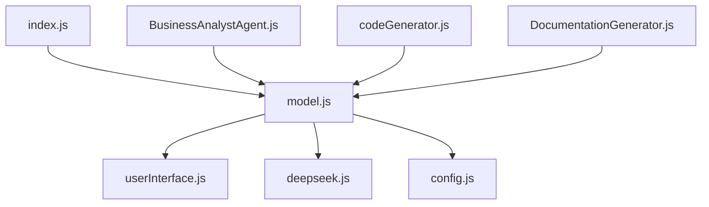

# Model Module Documentation (`model.js`)

## Overview

The `model.js` file serves as the core AI model interaction layer for the application. It acts as an abstraction layer for handling AI provider interactions, currently supporting:

-   Anthropic's Claude models
-   Deepseek's reasoning model ("deepseek-reasoner")

This module centralizes AI response generation logic and works with:

-   User preferences through `UserInterface`
-   Configuration values from `CONFIG`
-   Environment variables for API keys
-   External AI provider SDKs

Key responsibilities:

1. Model selection routing
2. Temperature configuration handling
3. Unified response generation interface
4. API key management

## Function Documentation

### `getResponse(prompt)`

```javascript
export async function getResponse(prompt)
```

#### Description

Main entry point for generating AI responses. Handles:

-   Model selection
-   Temperature configuration
-   Request routing to appropriate AI provider
-   Response normalization

#### Parameters

| Parameter | Type   | Description                        |
| --------- | ------ | ---------------------------------- |
| prompt    | string | Input text to send to the AI model |

#### Return Value

Returns a `Promise` that resolves to:

-   Anthropic: Full API response object
-   Deepseek: Generated text string

#### Process Flow

1. Retrieves user preferences for model and temperature
2. Routes to Deepseek if selected
3. Falls back to Anthropic Claude models otherwise
4. Returns raw provider response for upstream processing

#### Usage Example

```javascript
import { getResponse } from "./model.js";

const aiResponse = await getResponse("Explain quantum computing basics");
console.log(aiResponse);
```

## Project Integration

### Key Dependencies

| Dependency             | Purpose                             |
| ---------------------- | ----------------------------------- |
| `@anthropic-ai/sdk`    | Official Claude API client          |
| `./userInterface.js`   | User preference management          |
| `./config.js` (CONFIG) | Application configuration constants |
| `./deepseek.js`        | Deepseek API integration            |

### Environmental Requirements

```dotenv
CLAUDE_KEY=your_api_key_here  # Required for Anthropic integration
```

### Architectural Role

This module serves as:

1. Primary AI interface for agent modules (`*Agent.js` files)
2. Configuration bridge between user preferences and core logic
3. Abstraction layer for multiple AI providers
4. Central point for model parameter management

## Configuration Details

### Runtime Configuration

| Source             | Value           | Default               |
| ------------------ | --------------- | --------------------- |
| `UserInterface`    | model selection | None (required input) |
| `UserInterface`    | temperature     | None (required input) |
| `CONFIG.maxTokens` | Response length | Defined in config.js  |

## Error Handling

The current implementation:

-   Relies on upstream error handling
-   Propagates API errors directly to callers
-   Requires proper environment variable configuration
-   Assumes valid model selection from UserInterface

## Best Practices

1. Set temperature according to use case:
    - Lower (0-0.3): Factual responses
    - Medium (0.3-0.7): Balanced creativity
    - High (0.7-1): Maximize creativity
2. Monitor Anthropic API usage through their dashboard
3. Use model selection validation in upstream components
4. Implement retry logic in consumer modules

## Example Integration

Typical usage in agent modules:

```javascript
// In BusinessAnalystAgent.js
async function generateAnalysis(requirements) {
    const prompt = `Analyze these business requirements: ${requirements}`;
    return await getResponse(prompt);
}
```

## Project Structure Context


